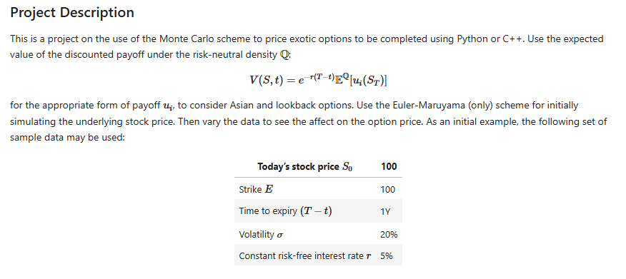

# Exotics-option-pricing-research
This project explores different methods to price path dependent exotic options, primarily focusing on different types of Asian and Lookback options. The project also compared their prices to vanilla options under different configurations and market environments. 
The description of the research question can be found below: 

Traditional option pricing models, such as the Black-Scholes model, make specific assumptions about market behavior such as constant volatility and log-normal distribution of stock prices which do not hold for exotic options. Exotic options like Asian and lookback options have features that introduce path dependency and averaging, which present unique challenges for pricing. Furthermore, real markets often exhibit dynamic volatility, which can have a significant impact on the value of these complex derivatives. 
